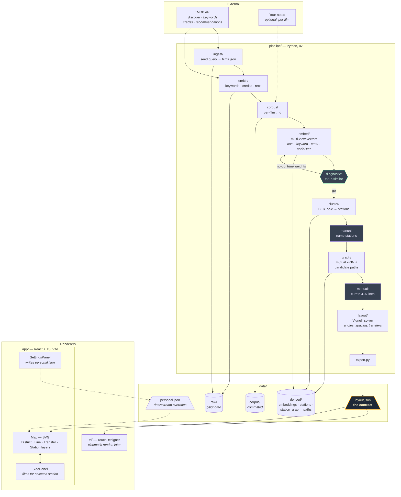

# Flickseed

A cinematic subway-map of films. Stations are concepts (mood, texture, register);
films are listed in a side panel when you click a station. Lines are curated
journeys through embedding space.

## Repo shape

```
app/             React + TypeScript renderer (Vite, Tailwind v4)
pipeline/        Python data pipeline (uv-managed) — writes data/layout.json
data/            layout.json (the contract) + corpus/ + derived artefacts
td/              TouchDesigner files (later)
.claude/skills/  Project-local Claude Code skills (see below)
```

## Run it

```bash
# Renderer (placeholder until the pipeline has output)
cd app && npm install && npm run dev

# Pipeline (stages are stubs in Phase 0b)
cd pipeline && uv sync && uv run python -c "import flickseed_pipeline"
```

Running entirely locally for now — no deploy.

## Claude skills

Two project-local skills under `.claude/skills/` drive the data work. They
auto-load when Claude Code is opened in this workspace; invoke with a slash.

- **`/probe-tmdb`** — iterate on TMDB `/discover` filter combinations to
  settle the canonical seed query. Generates `pipeline/scripts/get_films.py`;
  outputs `pipeline/reports/film-report.md` for visual review. Edit the
  boilerplate query catalog inside the skill as your taste sharpens.
- **`/embed-films`** — run the representation-learning pipeline (enrich →
  feature-extract → embed → graph node2vec → multi-view compose, per
  [`PROJECT.md` §5](./PROJECT.md#5-the-corpus-problem-highest-leverage-decision)).
  Writes `data/derived/embeddings.parquet` plus a top-5-similar diagnostic at
  `pipeline/reports/embedding-diagnostic.md`. View weights live in
  `pipeline/config.yaml` — tweak and re-invoke.

Workflow: `/probe-tmdb` settles the query → commit it under
`pipeline/flickseed_pipeline/ingest/` → `/embed-films` consumes it.

## Architecture

The system has two halves separated by a single contract file, `data/layout.json`:

- **pipeline/** (Python, uv) — ingests films from TMDB, builds multi-view embeddings, clusters them into stations, discovers line candidates, solves a Vignelli-style layout, and exports `layout.json`.
- **app/** (React 19 + TypeScript, Vite) — consumes `layout.json` and renders an SVG subway map. Films appear in a side panel on station click, not as dots on the map.

Neither side crosses the boundary. The pipeline writes; the app reads.

### Diagram


