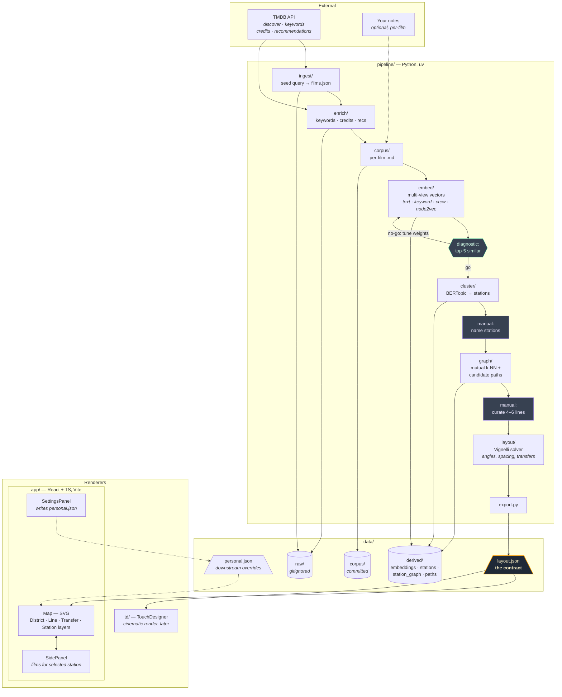

# Flickseed

A cinematic subway-map of films. Stations are concepts (mood, texture, register);
films are listed in a side panel when you click a station. Lines are curated
journeys through embedding space.

Architecture, decisions, and build order live in [`PROJECT.md`](./PROJECT.md).
Full diagram with legend and directory table in [`docs/architecture.md`](./docs/architecture.md).



## Repo shape

```
app/         React + TypeScript renderer (Vite, Tailwind v4)
pipeline/    Python data pipeline (uv-managed) — writes data/layout.json
data/        layout.json (the contract) + corpus/ + derived artefacts
td/          TouchDesigner files (later)
```

## Run it

```bash
# Renderer (placeholder until the pipeline has output)
cd app && npm install && npm run dev

# Pipeline (stages are stubs in Phase 0b)
cd pipeline && uv sync && uv run python -c "import flickseed_pipeline"
```

Running entirely locally for now — no deploy.
