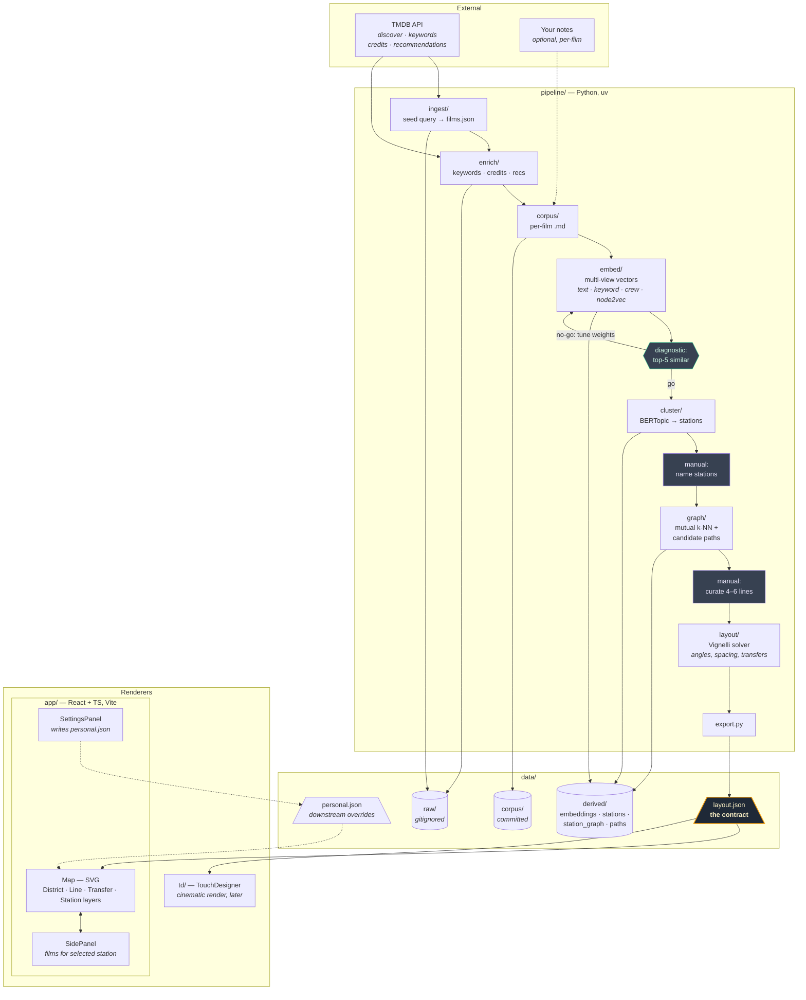

# Flickseed architecture

A bird's-eye view of how the pieces fit together. The Python pipeline turns
TMDB data into a geometric subway-map layout; renderers consume that layout
through a single committed contract: `data/layout.json`.

For decisions, rationale, and build order see [`../PROJECT.md`](../PROJECT.md).

## Reading the diagram

- **Solid arrows** = data flow committed to disk or fetched from the network.
- **Dashed arrows** = optional inputs / overlays that don't change pipeline geometry.
- **Amber outline** marks `layout.json`, the single contract between pipeline
  and renderers — neither renderer computes layout.
- **Purple outlines** mark the two manual curation steps (station naming, line
  selection). Everything else runs unattended.
- **Green outline** is the go/no-go diagnostic gate; failing it loops back into
  embedding-weight tuning rather than continuing downstream.

## What lives where

| Path | Role |
|---|---|
| `pipeline/flickseed_pipeline/` | Stage packages (ingest, enrich, corpus, embed, cluster, graph, layout) + `export.py` |
| `pipeline/scripts/` | CLI entry points (`run_pipeline.py`, `diagnose_embeddings.py`) |
| `data/raw/` | TMDB responses — large, regenerable, gitignored |
| `data/corpus/` | Per-film markdown — committed; the hand-curated asset |
| `data/derived/` | Embeddings, stations, station graph, candidate paths — committed |
| `data/layout.json` | The contract. Pipeline writes, renderers read |
| `data/personal.json` | Renderer-side overrides (renames, pins, hides). Commit status pending — see PROJECT.md §12 |
| `app/src/` | React renderer; Vite serves `data/` as `publicDir` so layout changes reload without rebuilding |
| `td/` | TouchDesigner renderer, parallel consumer of `layout.json` (later phase) |
