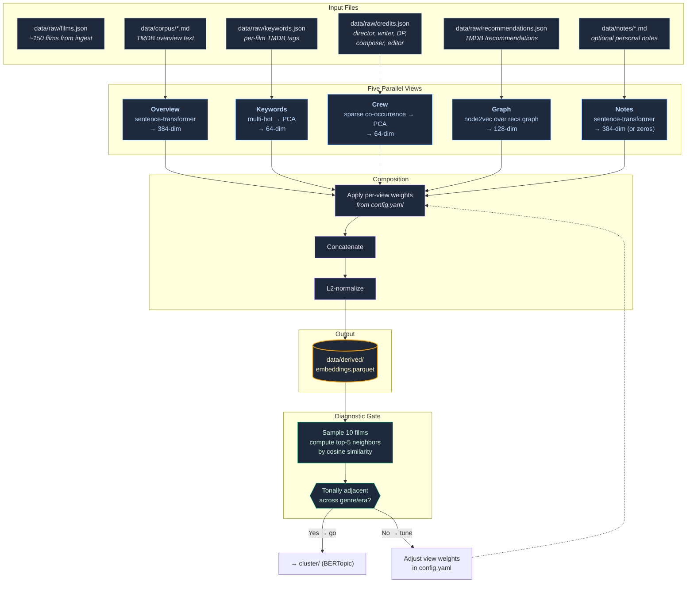

# Embedding Pipeline

The embedding stage turns ~150 curated films into multi-dimensional vectors that
capture what each film *feels like* — not just its genre or era, but its creative
fingerprint across five independent signals. These vectors are the foundation for
everything downstream: clustering into stations, finding edges between stations,
and ultimately the shape of the subway map. Getting embeddings right is the
highest-leverage decision point in the entire pipeline — bad vectors cascade into
bad clusters, bad lines, and a map that doesn't feel right.

## How it works



## Input files

| File | Contents | Produced by | Tracked |
|---|---|---|---|
| `data/raw/films.json` | ~150 seed films (tmdb_id, title, year, overview, genres, votes) | `ingest/` — TMDB `/discover` queries | gitignored |
| `data/raw/keywords.json` | Per-film keyword tags from TMDB | `enrich/` — `/movie/{id}/keywords` | gitignored |
| `data/raw/credits.json` | Director, writers, DP, composer, editor per film | `enrich/` — `/movie/{id}/credits` | gitignored |
| `data/raw/recommendations.json` | Related films from TMDB's recommendation engine | `enrich/` — `/movie/{id}/recommendations` | gitignored |
| `data/corpus/*.md` | TMDB overview + optional notes, one file per film | `corpus/` | committed |
| `data/notes/{tmdb_id}.md` | Hand-written personal notes (1–2 sentences) | You, manually | committed |

All `data/raw/` files are cached on disk. Re-running the pipeline skips fetching
endpoints that already have cached responses unless you pass `--refresh`.

## What is `data/corpus/`?

The `corpus/` stage generates one markdown file per film under `data/corpus/`.
These are the text documents that the overview view embeds. Each file follows
this template:

```
# Blade Runner (1982)
Director: Ridley Scott   Country: US

A blade runner must pursue and terminate four replicants who stole a ship
in space and have returned to Earth to find their creator.

[Optional: personal notes from data/notes/604.md]
```

The text is intentionally lean — just the TMDB overview plus optional personal
notes. Rather than enriching the text with Wikipedia plots or critic blurbs, the
embedding stage compensates via the non-text views (keywords, crew, graph). This
keeps the corpus simple and the embedding quality tunable via view weights.

## The five views

Each view captures a different signal about what makes a film *that film*. The
multi-view approach prevents any single signal (especially genre) from dominating.

### 1. Overview — text semantics (384-dim)

**What it captures:** The narrative and thematic content of the film as described
by its TMDB overview.

**How:** The overview text is passed through
[`all-MiniLM-L6-v2`](https://huggingface.co/sentence-transformers/all-MiniLM-L6-v2),
a sentence-transformer that maps text to a 384-dimensional vector. Films with
similar plots, themes, or tonal descriptions end up close in this space.

**Risk:** Overviews tend to emphasize genre and plot beats. If this view
dominates, you get genre-clusters instead of tonal ones. That's why its default
weight is `1.0` while the graph view gets `1.5`.

### 2. Keywords — thematic tags (64-dim)

**What it captures:** TMDB's community-tagged keywords (e.g. "dystopia,"
"time travel," "based on novel"). These are more fine-grained than genres.

**How:** Keywords are multi-hot encoded — each film gets a binary vector over the
full keyword vocabulary. This high-dimensional sparse vector is then reduced to
64 dimensions via PCA (scikit-learn).

**Why PCA?** The raw keyword space is huge and sparse. PCA finds the axes of
maximum variance, compressing down to the dimensions that actually distinguish
films from each other.

### 3. Crew — creative fingerprint (64-dim)

**What it captures:** Films that share creative DNA — same director, writer, DP,
composer, or editor tend to have similar visual/narrative sensibilities.

**How:** A sparse co-occurrence matrix is built from the key crew members
(director, writers, DP, composer, editor). Films sharing crew members have
non-zero overlap. This matrix is PCA-reduced to 64 dimensions.

**Why these roles?** Director and writer are obvious. DP (cinematographer),
composer, and editor shape the *feel* of a film in ways that genre tags can't
capture. A Roger Deakins film looks like a Roger Deakins film regardless of genre.

### 4. Graph — structural neighborhood (128-dim)

**What it captures:** Where a film sits in the web of "if you liked X, you'll
like Y" relationships, independent of any text or metadata.

**How:**
1. Build a directed graph where nodes are films and edges come from TMDB's
   `/recommendations` endpoint (film A recommends film B → edge A→B).
2. Include 1-hop neighbors: films outside the seed set that appear as
   recommendations are added as "anchor nodes" to give the graph more structure.
3. Run [node2vec](https://arxiv.org/abs/1607.00975) — random walks over the
   graph, fed into a Word2Vec-style model — to produce a 128-dim vector per film.

**Why this is weighted highest (1.5):** TMDB recommendations encode audience
taste patterns that don't show up in text descriptions. Two films might have
completely different plots and genres but get recommended together because they
appeal to the same audience. This is the signal that prevents genre-clustering.

**node2vec hyperparameters:** `p=1.0, q=1.0` (unbiased random walk) is the
default. Lowering `q` makes walks more DFS-like (structural roles); raising `q`
makes walks more BFS-like (local communities). Configured in `pipeline/config.yaml`.

### 5. Notes — personal signal (384-dim, optional)

**What it captures:** Your personal take on a film — whatever you find notable
that TMDB doesn't say.

**How:** If `data/notes/{tmdb_id}.md` exists for a film, it's embedded with the
same sentence-transformer as the overview. If no notes file exists, the view
produces a zero vector.

**Zero-vector handling:** When a film has no notes, the zero vector effectively
removes this view's contribution for that film (weight × zeros = zeros). The
composed vector is then L2-normalized, so the remaining views fill the space.

## Vector composition

The five per-view vectors are combined into a single final vector per film:

1. **Weight:** Each view's vector is multiplied by its weight from `pipeline/config.yaml`
2. **Concatenate:** The weighted vectors are joined end-to-end
3. **L2-normalize:** The result is scaled to unit length

The final vector dimensionality is `384 + 64 + 64 + 128 + 384 = 1024` (before
normalization, which preserves dimensionality but scales magnitude to 1).

Default weights:

| View | Weight | Rationale |
|---|---|---|
| overview | 1.0 | Baseline text signal |
| keywords | 0.5 | Supplementary — tags are noisy |
| crew | 0.5 | Supplementary — sparse for smaller films |
| graph | 1.5 | Primary structural signal; prevents genre-clustering |
| notes | 1.0 | Personal curation, when present |

Higher weight = more influence on which films end up near each other. Tune these
in `pipeline/config.yaml` and re-run the pipeline.

## Output files

| File | Format | Contents | Tracked |
|---|---|---|---|
| `data/derived/embeddings.parquet` | Parquet (pandas + pyarrow) | One row per film: `tmdb_id`, `title`, `vector` (final composed), plus `vector_overview`, `vector_keywords`, `vector_crew`, `vector_graph`, `vector_notes` for debugging | committed |
| `pipeline/reports/embedding-diagnostic.md` | Markdown | Top-5 most-similar neighbors for 10 random films | gitignored |

The per-view sub-vectors are kept in the parquet for debugging and re-weighting —
you can change weights and recompose without re-fetching from TMDB or re-running
sentence-transformers.

## Configuration

All embedding parameters live in `pipeline/config.yaml`. The `/embed-films` skill
creates this file with defaults if it doesn't exist.

```yaml
view_weights:
  overview: 1.0       # text: TMDB overview → sentence-transformer
  keywords: 0.5       # TMDB tags → multi-hot → PCA
  crew: 0.5           # director/writer/DP/composer/editor → co-occurrence → PCA
  graph: 1.5          # TMDB /recommendations → node2vec
  notes: 1.0          # personal notes → sentence-transformer (zeros if missing)

models:
  text_embed: "sentence-transformers/all-MiniLM-L6-v2"
  text_dim: 384           # output dim of the sentence-transformer
  keyword_pca_dim: 64     # PCA target for keyword multi-hot
  crew_pca_dim: 64        # PCA target for crew co-occurrence
  node2vec:
    dim: 128              # embedding dimensions
    walk_length: 30       # steps per random walk
    num_walks: 200        # walks per node
    p: 1.0                # return parameter (lower = more local)
    q: 1.0                # in-out parameter (lower = DFS-like, higher = BFS-like)

graph:
  edges_from: ["recommendations"]   # could add "similar" for denser graph
  include_one_hop_neighbors: true   # include non-seed films from recs as anchors
```

## The diagnostic gate

After embedding, the pipeline produces a diagnostic report before proceeding to
clustering. This is a **manual go/no-go gate** — the single most important
quality check in the pipeline.

### What the report looks like

```markdown
# Embedding Diagnostic — 2026-05-25

**Config:** view weights = {overview: 1.0, keywords: 0.5, crew: 0.5, graph: 1.5, notes: 1.0}
**Corpus size:** 152 films
**Verdict (fill in):** [ ] tonally adjacent / [ ] same genre, same era / [ ] mixed

## Sample 1: Blade Runner (1982)
Top-5 most similar:
1. Stalker (1979) — cosine 0.87
2. Ex Machina (2014) — cosine 0.84
3. Under the Skin (2013) — cosine 0.81
4. Annihilation (2018) — cosine 0.79
5. Solaris (1972) — cosine 0.77
```

### How to read it

**"Tonally adjacent across genre/era" → proceed.** The neighbors should feel
like films that belong in the same subway station — not because they're the
same genre, but because they share a *vibe*. Blade Runner's neighbors above span
decades and subgenres, but they all share a contemplative, atmospheric quality.

**"Same genre, same era" → tune weights, re-run.** If Blade Runner's neighbors
are all 1980s sci-fi action films, the text overview is dominating. Raise `graph`
weight (try `2.0`), lower `overview` (try `0.7`), re-embed, and check again.

**"Mixed" → investigate.** Some samples look good, others don't. Look at which
views are pulling films together and adjust. The per-view sub-vectors in the
parquet can help diagnose which signal is causing problems.

Do not proceed to clustering until the diagnostic looks right. This is the gate.

## Code files

| File | Role | Status |
|---|---|---|
| `pipeline/flickseed_pipeline/embed/__init__.py` | Stage module declaration | Stub (docstring only) |
| `pipeline/flickseed_pipeline/enrich/__init__.py` | Upstream enrichment — fetches keywords, credits, recs from TMDB | Stub — enrichment logic lives in `enrich_and_embed.py` |
| `pipeline/scripts/enrich_and_embed.py` | Workhorse script that runs the full embed pipeline | Generated by `/embed-films` skill |
| `pipeline/scripts/diagnose_embeddings.py` | Standalone diagnostic (top-5 neighbors) | Stub |
| `.claude/skills/embed-films.md` | Skill definition — orchestrates the entire embed workflow | Complete |
| `pipeline/config.yaml` | View weights + model parameters | Created by skill if missing |

The `/embed-films` skill generates `enrich_and_embed.py` each time it runs. The
script shape follows the pattern in the skill file — see
`.claude/skills/embed-films.md` for the full outline.

## Key dependencies

| Library | Used for | Install |
|---|---|---|
| `sentence-transformers` | Text embedding (overview + notes) | `uv sync` (in pyproject.toml) |
| `scikit-learn` | PCA dimensionality reduction (keywords + crew) | `uv sync` |
| `networkx` | Graph construction from recommendations | `uv sync` |
| `node2vec` | Random-walk graph embedding | `uv sync` |
| `pandas` + `pyarrow` | Parquet I/O for embeddings | `uv sync` |
| `numpy` | Vector math | `uv sync` |
| `httpx` | TMDB API calls (enrichment) | `uv sync` |
| `pyyaml` | Config file parsing | `uv sync` |

All dependencies are declared in `pipeline/pyproject.toml`. Run `uv sync` from
`pipeline/` to install.

## Where embedding fits in the pipeline

```
ingest → enrich → corpus → [embed] → cluster → graph → layout → export
                             ^^^^
                           you are here
```

**Upstream:** `ingest/` produces `films.json`, `enrich/` fetches per-film
metadata, `corpus/` writes per-film markdown.

**Downstream:** `cluster/` reads `embeddings.parquet` and runs BERTopic to group
films into 25–40 stations. The quality of clusters depends entirely on the
quality of these vectors.
